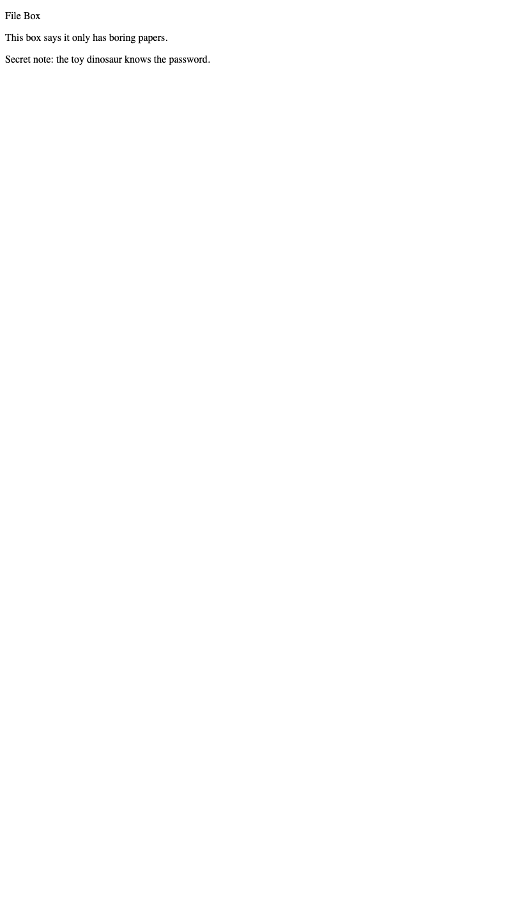

<h2 class="c-project-heading--task">Add the secret note</h2>

You will add one hidden note inside the box.

Open `index.html` and add one more paragraph for the secret note inside the box.

--- code ---
---
language: html
filename: index.html
line_numbers: true
line_number_start: 1
line_highlights: 12-14
---
<!doctype html>
<html lang="en">
  <head>
    <meta charset="utf-8">
    <meta name="viewport" content="width=device-width, initial-scale=1">
    <title>Indieweb Hover Secret Message</title>
    <link rel="stylesheet" href="style.css">
  </head>
  <body>
    <main class="secret-box">
      
File Box

      
This box says it only has boring papers.

      <!-- Add one hidden note inside the same box. -->
      
Secret note: the toy dinosaur knows the password.

    </main>
  </body>
</html>
--- /code ---

<h2 class="c-project-heading--task">Test</h2>

You should see the new secret note inside the box for now.

  

