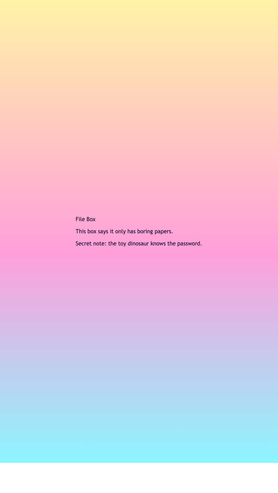

<h2 class="c-project-heading--task">Add the fake cover story</h2>

Add one cover-note paragraph underneath the mood line so the file pretends to be normal. When the user hovers over this text, more words will appear beneath. 

<h2 class="c-project-heading--explainer">Make this change</h2>

Put the new paragraph inside `<main class="secret-box">`, underneath `
`. It can say anything you like.

--- code ---
---
language: html
filename: index.html
line_numbers: true
line_number_start: 9
line_highlights: 13
---
    <main class="secret-box">
      
Recovered hover artefact // cached at 2:17am

      <h1>chatlog_FINAL-final_REAL.txt</h1>
      
mood: blocked by the glitter cursor

      
Hover over this file if you enjoy fake evidence and catastrophic profile decisions.

    </main>
--- /code ---

## Now run your code

You should see the extra cover story paragraph underneath the mood line.

  

