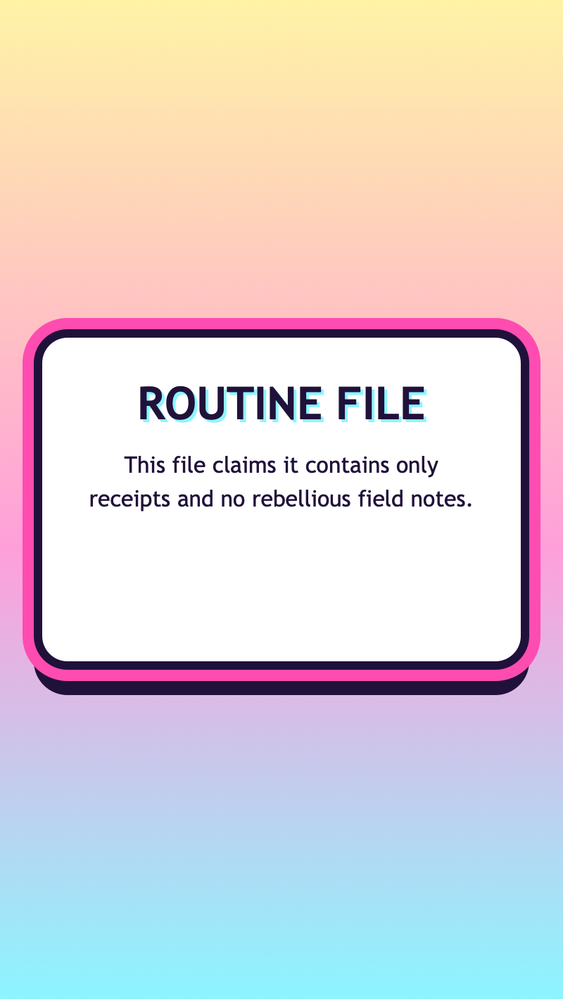

<h2 class="c-project-heading--task">Hide the message</h2>

You will style the secret message so it starts invisible and ready to slide in later.

Stay in `style.css` and add the `.secret-message` rule underneath `.box-note`.

--- code ---
---
language: css
filename: style.css
line_numbers: true
line_number_start: 43
line_highlights: 45-52
---
}

.secret-message {
  margin: 18px 0 0;
  color: #a6005d;
  font-weight: 700;
  opacity: 0;
  transform: translateY(12px);
  transition: opacity 0.25s ease, transform 0.25s ease;
}
--- /code ---

<h2 class="c-project-heading--task">Test</h2>

The box should still be styled, but the secret-agent note should now disappear.

  

