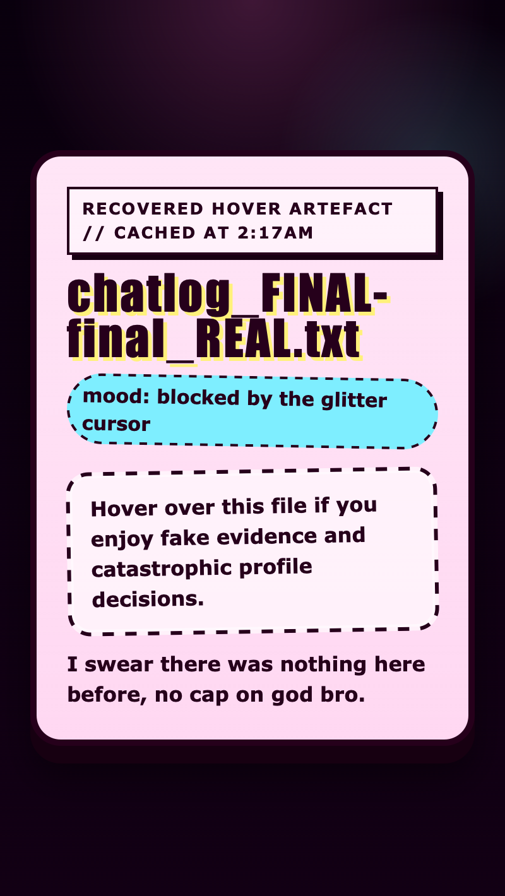

<h2 class="c-project-heading--task">Style the cover story</h2>

Give the cover story its own suspicious sticker look so it stands apart from the rest of the text.

<h2 class="c-project-heading--explainer">Make this change</h2>

Stay in `style.css` and add this `.cover-note` rule underneath the `p` rule.

This rule only styles the paragraph with class `cover-note`. It turns the plain text into a separate sticker-like block.

--- code ---
---
language: css
filename: style.css
line_numbers: true
line_number_start: 88
line_highlights: 90-98
---
}

.cover-note {
  margin-top: 18px;
  padding: 14px 16px;
  border: 3px dashed var(--ink);
  border-radius: 18px;
  background: rgba(255, 255, 255, 0.62);
  box-shadow: inset 0 0 0 2px rgba(255, 255, 255, 0.48);
  transform: rotate(-1deg);
}
--- /code ---

<h3>Tip</h3>

Pick colours and styles you like by editing the values.

Small value changes can make the page feel really different!

<a href="https://www.google.com/search?q=web+colour+picker" target="_blank" rel="noopener noreferrer">Open the Google web colour picker in a new tab</a> if you want help choosing colours.

## Now run your code

The cover story should now look like a suspicious label stuck onto the file. 

  

