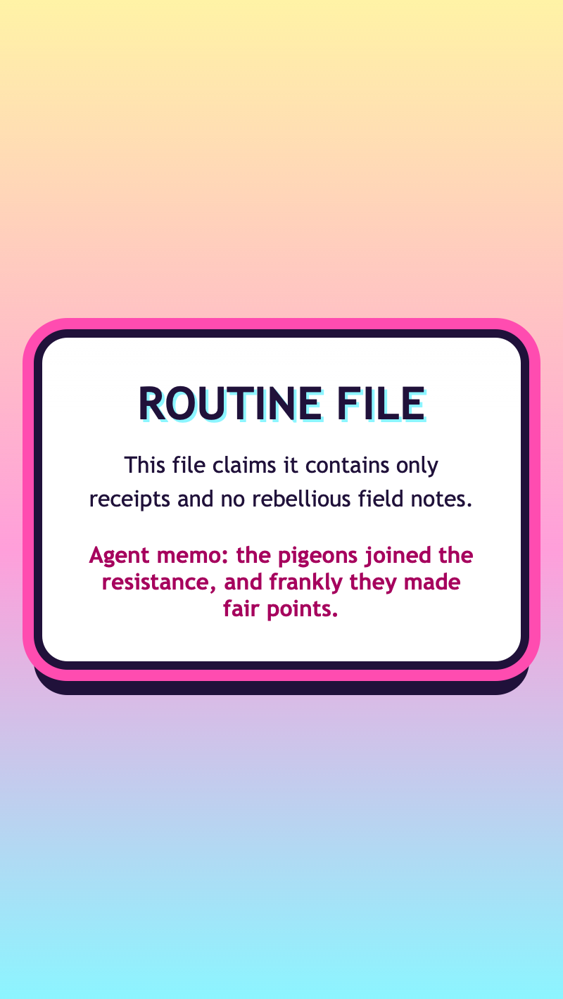

<h2 class="c-project-heading--task">Reveal it on hover</h2>

You will make the hidden message slide into view when you hover over the box.

Stay in `style.css` and add a hover rule underneath `.secret-message`.

--- code ---
---
language: css
filename: style.css
line_numbers: true
line_number_start: 52
line_highlights: 54-57
---
}

.secret-box:hover .secret-message {
  opacity: 1;
  transform: translateY(0);
}
--- /code ---

<h2 class="c-project-heading--task">Test</h2>

When you hover over the box, the secret note should slide into view.

  

