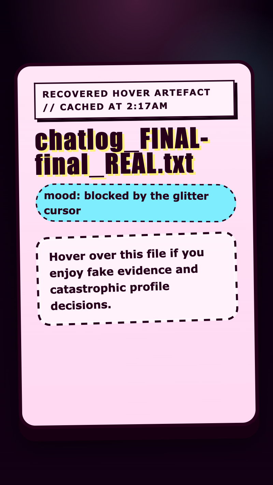

<h2 class="c-project-heading--task">Nudge the file on hover</h2>

Make the whole file shift slightly when someone hovers over it so the reveal feels more dramatic.

Stay in `style.css` and add this `.secret-box:hover` rule underneath `.secret-message`. This rule only works while the mouse is over `.secret-box`. It tilts the whole file and changes the shadow so the hover feels more dramatic.

--- code ---
---
language: css
filename: style.css
line_numbers: true
line_number_start: 111
line_highlights: 113-118
---
}

.secret-box:hover {
  transform: rotate(-0.8deg) translateY(3px);
  box-shadow:
    0 18px 0 var(--shadow-color),
    0 30px 34px rgba(0, 0, 0, 0.42);
}
--- /code ---

## Now run your code

When you hover over the file, the box should tilt and drop slightly, but the leaked note should still stay hidden.

  

