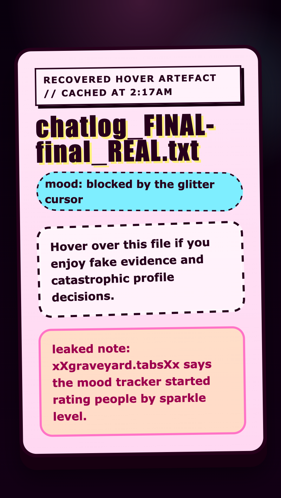

<h2 class="c-project-heading--task">Reveal the leaked note</h2>

Show the hidden note when the file is hovered so the whole trick finally works.

Stay in `style.css` and add this `.secret-box:hover .secret-message` rule underneath `.secret-box:hover`. This rule only works while the mouse is over `.secret-box`. It makes `.secret-message` visible again by changing the `opacity` to `1` and moving the note back into place.

--- code ---
---
language: css
filename: style.css
line_numbers: true
line_number_start: 118
line_highlights: 120-123
---
}

.secret-box:hover .secret-message {
  opacity: 1;
  transform: translateY(0) scale(1);
}
--- /code ---

## Now run your code

When you hover over the file, the leaked note should appear underneath the cover story.

  

